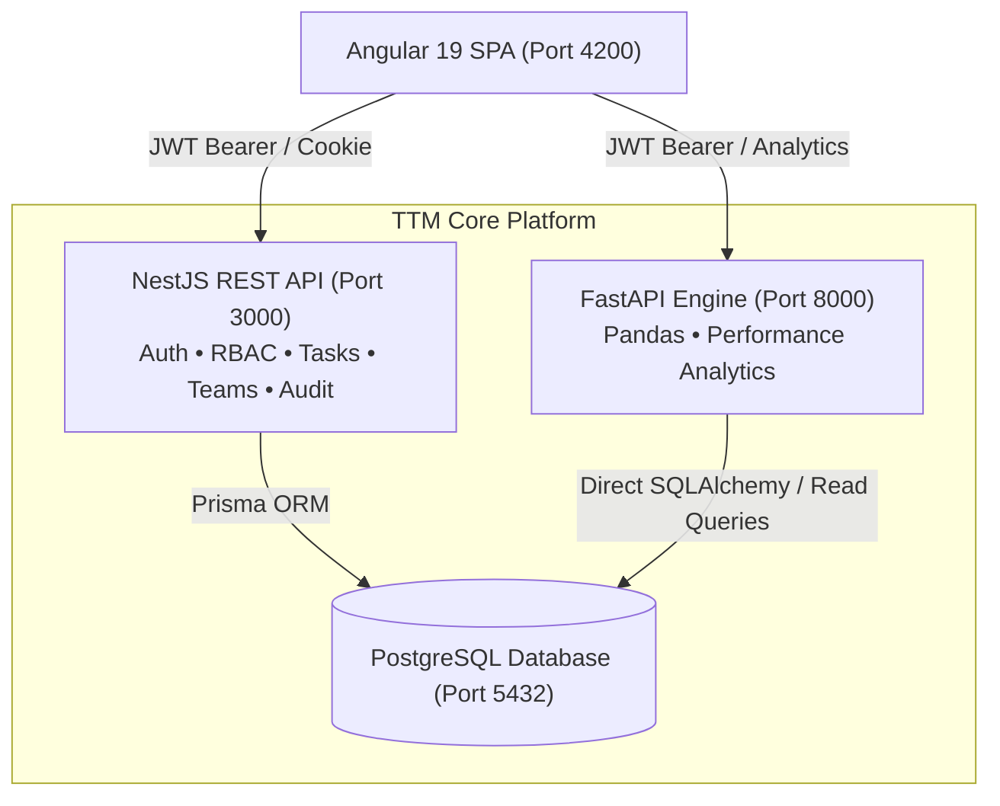

# 🚀 Task Tracker Manager (TTM)

[](https://nestjs.com/)
[](https://angular.dev/)
[](https://fastapi.tiangolo.com/)
[](https://www.postgresql.org/)
[](https://www.prisma.io/)
[](https://www.typescriptlang.org/)

**Task Tracker Manager (TTM)** is an enterprise-grade, full-stack task management and workforce analytics platform. Built with a distributed service architecture, it combines a secure **NestJS** core backend, a high-performance **Python FastAPI** analytical engine, and a modern, responsive **Angular 19** frontend.

---

## 🏛 Architecture Overview



The system is organized into three microservices:

1. **`ttm_backend/` (Core API)**: NestJS backend providing JWT authentication (access tokens + rotated refresh cookies), 5-tier role-based access control (RBAC), audit logging, and task/team management.
2. **`ttm_analytics_service/` (Analytics Engine)**: Python FastAPI microservice utilizing Pandas and NumPy for real-time aggregation of team productivity, completion rates, and executive summaries.
3. **`ttm_frontend/` (SPA)**: Angular 19 application featuring role-tailored dashboards (Super Admin, Admin, Manager, Team Lead, and Member), dark/light mode, and task workflow boards.

---

## 🛡 5-Tier Role-Based Access Control (RBAC)

TTM enforces strict organizational hierarchy rules across all services:

| Tier | Role | Primary Responsibilities & Permissions |
| :---: | :--- | :--- |
| **5** | **SUPER_ADMIN** | System owner with unrestricted access. Governs roles, permissions, audit trails, and all organizational units. |
| **4** | **ADMIN** | Enterprise administrator managing operational managers, team assignments, and user provisioning. |
| **3** | **MANAGER** | Department/Unit manager supervising team leads, monitoring overdue tasks, and tracking department performance metrics. |
| **2** | **TEAM_LEAD** | Operational lead overseeing individual contributors, task assignment, status updates, and daily sprints. |
| **1** | **TEAM_MEMBER** | Individual contributor executing tasks and progressing personal task boards (`TODO` ➔ `IN_PROGRESS` ➔ `IN_REVIEW` ➔ `DONE`). |

---

## ⚡ Tech Stack

### Backend Core (`ttm_backend`)
- **Framework**: NestJS 11 (Express platform)
- **Database & ORM**: PostgreSQL with Prisma ORM 7
- **Authentication**: Passport JWT, Access Token rotation, Bcrypt password hashing, HttpOnly cookies
- **Security**: Helmet headers, Rate limiting (Throttler), Class-validator DTOs
- **API Docs**: Swagger / OpenAPI at `/api/docs`

### Analytics Engine (`ttm_analytics_service`)
- **Framework**: FastAPI with Uvicorn ASGI
- **Data Engine**: Pandas 2.2 & NumPy for fast matrix computations
- **Authentication**: PyJWT matching backend secrets
- **Database Driver**: SQLAlchemy with psycopg2

### Frontend Client (`ttm_frontend`)
- **Framework**: Angular 19 (Standalone components, reactive signals)
- **Styling**: Modern CSS design system with Dark/Light theme switching
- **HTTP**: Centralized `AuthInterceptor` with automatic token refresh on `401 Unauthorized`

---

## 🔑 Demo Credentials

Pre-seeded accounts available for local evaluation:

| Role | Email | Password |
| :--- | :--- | :--- |
| **Super Admin** | `superadmin@company.local` | `SuperAdminPass123!` |
| **Admin** | `testadmin@company.local` | `Password123!` |
| **Manager** | `manager1@company.local` | `Password123!` |
| **Team Lead** | `lead1@company.local` | `Password123!` |
| **Team Member** | `member1@company.local` | `Password123!` |

---

## 🚀 Getting Started

### 🐳 Instant Docker Quickstart (Recommended)
You can launch the entire ecosystem (PostgreSQL, NestJS backend, FastAPI analytics, and Angular frontend) with a single command:
```bash
docker compose up -d --build
```
- Web Application: **`http://localhost:4200`**
- Core API & Swagger: **`http://localhost:3000/api/docs`**
- Analytics Engine: **`http://localhost:8000/docs`**

For comprehensive cloud hosting (Render, Railway, Vercel, VPS) details, see the **[Production Deployment Guide](DEPLOYMENT.md)**.

---

### Manual Local Development Setup

#### Prerequisites
- **Node.js**: v18+ (tested on v20/v22)
- **Python**: v3.11+
- **PostgreSQL**: Running locally on port `5432`

---

### 1. Database Setup

Ensure PostgreSQL is running and create the database:
```sql
CREATE DATABASE task_manager_db;
```

---

### 2. Core Backend Setup (`ttm_backend`)

```bash
cd ttm_backend

# Install dependencies
npm install

# Configure environment
cp .env.example .env
# Edit .env with your PostgreSQL credentials

# Run database migrations and seed initial roles/super admin
npx prisma migrate deploy
npx ts-node prisma/seed.ts

# Start backend server
npm start
```
- Core API runs at: **`http://localhost:3000`**
- Swagger Documentation: **`http://localhost:3000/api/docs`**

---

### 3. Analytics Service Setup (`ttm_analytics_service`)

```bash
cd ../ttm_analytics_service

# Create and activate virtual environment
python -m venv venv
# On Windows:
.\venv\Scripts\activate
# On Linux/macOS:
source venv/bin/activate

# Install requirements
pip install -r requirements.txt

# Configure environment
cp .env.example .env

# Launch FastAPI service
uvicorn app.main:app --host 0.0.0.0 --port 8000 --reload
```
- Analytics Engine runs at: **`http://localhost:8000`**
- Interactive API Docs: **`http://localhost:8000/docs`**

---

### 4. Frontend Client Setup (`ttm_frontend`)

```bash
cd ../ttm_frontend

# Install dependencies
npm install

# Start Angular development server
npm start
```
- Web Application runs at: **`http://localhost:4200`**

---

## 📂 Repository Structure

```text
task-tracker-manager/
├── ttm_backend/                 # NestJS Application
│   ├── prisma/                  # Prisma schema, migrations, seeders
│   ├── src/                     # Auth, Users, Roles, Tasks, Teams, Audit
│   └── .env.example             # Backend configuration template
├── ttm_analytics_service/       # FastAPI Analytics Microservice
│   ├── app/                     # Analytics endpoints & Pandas algorithms
│   ├── requirements.txt         # Python dependencies
│   └── .env.example             # Analytics configuration template
├── ttm_frontend/                # Angular 19 SPA
│   ├── src/app/pages/           # Dashboards, Auth, Tasks, Roles/Permissions
│   └── src/app/core/            # Guards, Interceptors, Services
├── .gitignore                   # Root gitignore protecting secrets & dependencies
└── README.md                    # Project documentation
```

---

## 📄 License
This project is licensed under the MIT License.
